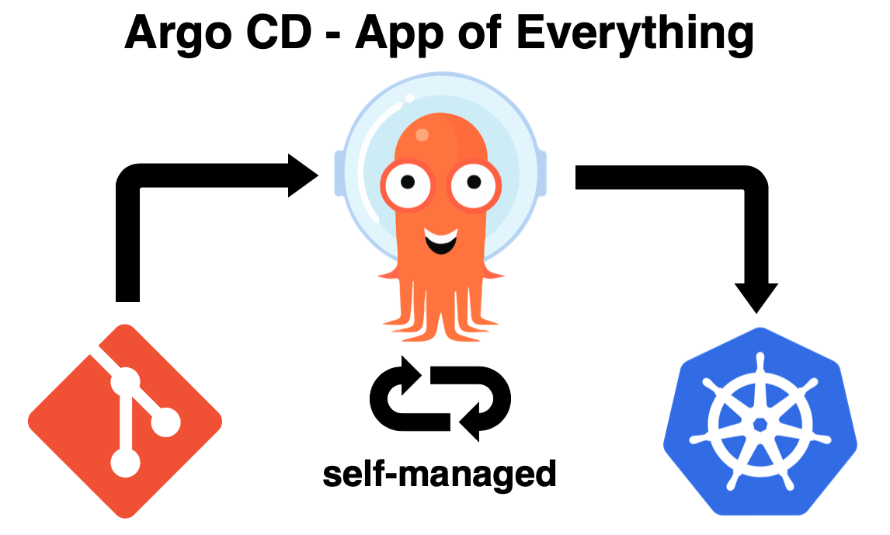

# Quest EKS Cluster State
This repo contains the cluster bootstrap state using the ArgoCD app-of-apps pattern.

To understand the details please see the [README of the core-bootstrap](https://github.com/defi-magi/quest-eks-modules/tree/main/core-bootstrap) module.



```
├── README.md
├── apps
│   ├── argo-ingress
│   │   ├── Chart.yaml
│   │   ├── templates
│   │   │   └── argo-ingress.yaml
│   │   └── values.yaml
│   ├── cluster-issuer
│   │   ├── Chart.yaml
│   │   ├── templates
│   │   │   └── cluster-issuer.yml
│   │   └── values.yaml
│   └── quest-pre-reqs-00
│       ├── Chart.yaml
│       ├── templates
│       │   └── pre-reqs-00.yaml
│       └── values.yaml
└── environments
    ├── Chart.yaml
    ├── templates
    │   ├── argo-ingress.yaml
    │   ├── aws-load-balancer-controller.yaml
    │   ├── cert-manager.yaml
    │   ├── cluster-issuer.yaml
    │   ├── external-dns.yaml
    │   ├── external-secrets.yaml
    │   ├── metrics-server.yaml
    │   ├── nginx-ingress-controller.yaml
    │   └── quest-pre-reqs-00.yaml
    └── values.yaml
```